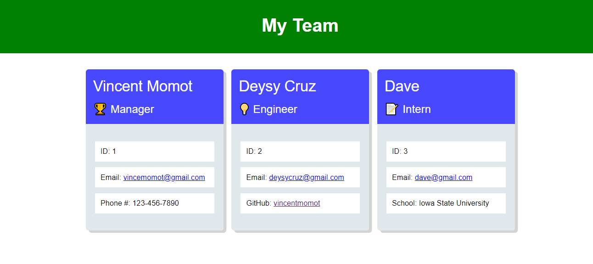

# Vince's-Team-Generator
This application is used to create a team layout for all members inculding engineer, intern and manager.

### Website Features:
1) Add one manager to the team with endless interns and engineers
2) Managers are given a phone number, engineers a github link, and interns a school
3) GitHub links redirect the user to the profile
4) Email link opens an email addressed to the address
5) A website is then rendered with styling to showcase cards for each employee

### What I learned from the creation of this site:
* Better understanding of Node.js
* Running tests with jest
* Better understanding of constructors and promises

[This is a link to the video walkthrough](https://youtu.be/5fUWh-jQCBw)

Screenshots of the site:

